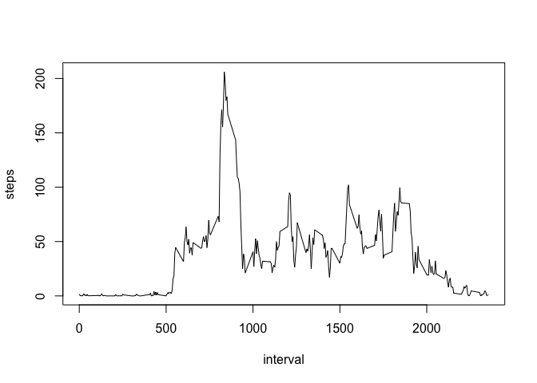

## Loading and preprocessing the data
* drop NA and group data with date to sum everyday steps

```r
unzip("activity.zip")
library(readr)
library(dplyr)
dataset <- read_csv("activity.csv", na = "NA")
steps<-dataset%>%group_by(date)%>%summarise(steps=sum(steps,na.rm=TRUE))
steps<-filter(steps,steps!=0)
```


## What is mean total number of steps taken per day?
* hist steps taken per day

```r
hist(steps$steps)
```

<!-- -->

* calculate mean and median of steps taken per day

```r
mean<-mean(steps$steps)
median<-median(steps$steps)
```
* The **mean**  steps taken per day is 1.0766189\times 10^{4} steps.
* The **median** steps taken per day is 1.0765\times 10^{4}steps.

## What is the average daily activity pattern?
* Make a time series plot of the average steps taken per 5-minutes interval.

```r
interval_steps<-dataset%>%group_by(interval)%>%summarise(steps=mean(steps,na.rm=TRUE))
plot(steps~interval,data=interval_steps,type="l")
```

<!-- -->

## Imputing missing values
* Calculate and report the total number of missing values in the dataset 

```r
sum(is.na(dataset$steps))
```

```
## [1] 2304
```

* Devise a strategy for filling in all of the missing values in the dataset. use the mean for that 5-minute interval.

```r
filled_set<-merge(dataset,interval_steps,by="interval")
filled_set<-mutate(filled_set,steps=ifelse(is.na(steps.x),steps.y,steps.x))
filled_set<-select(filled_set,c("date","interval","steps"))
```

* Make a histogram of the total number of steps taken each day and Calculate and report the mean and median total number of steps taken per day. 

```r
filled_steps<-filled_set%>%group_by(date)%>%summarise(steps=sum(steps,na.rm=TRUE))
hist(filled_steps$steps)
```

<!-- -->

* calculate mean and median of steps taken per day

```r
filled_mean<-mean(filled_steps$steps)
filled_median<-median(filled_steps$steps)
```
* There is no much difference between filled_mean: 1.0766189\times 10^{4} and mean:1.0766189\times 10^{4} ,filled_median:1.0766189\times 10^{4}and median: 1.0765\times 10^{4}. 


## Are there differences in activity patterns between weekdays and weekends?

```r
library(lubridate)
dataset<-mutate(dataset,is.weekend=ifelse(wday(date)==1|wday(date)==7,"weekend","weekday"))
interval_week_steps<-dataset%>%group_by(interval,is.weekend)%>%summarise(steps=mean(steps,na.rm=TRUE))
library(lattice)
xyplot(steps~interval|is.weekend,data=interval_week_steps,type="l")
```

<!-- -->

